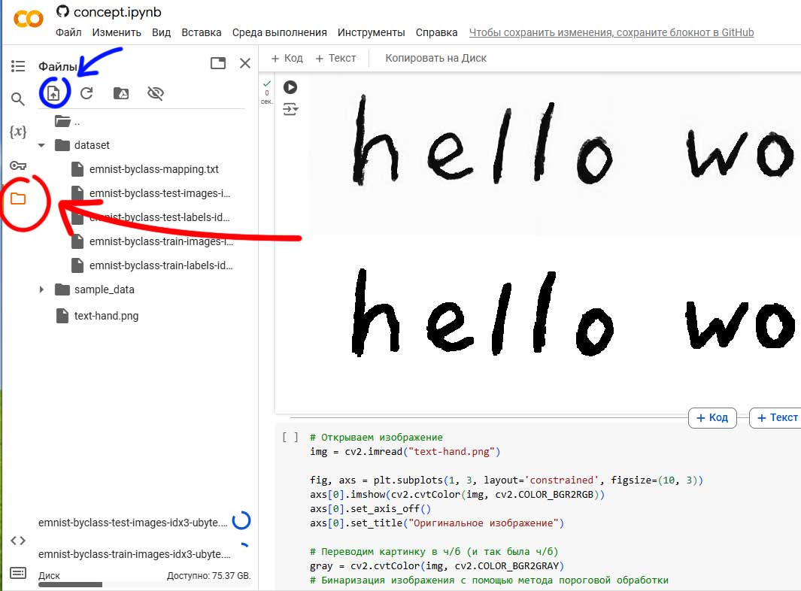

# Machine Learning Course: Text Recognition

Задача: распознания рукописного текста.

Данная часть курса предлагает разобраться с основами обучения нейронной сети для классификации рукописных символом и распознания текста.

## Подготовка окружения

Для данной задачи требуется:

* Python 3.10
* OpenCV - для работы с изображением (чтение файлов изображений, кроп, выделение контуров)
* idx2numpy - работа с датасетами в формате idx
* Tensorflow, Keras - для обучения нейронной сети
* sklearn - для метрик качества обучения

Окружение - это набор подготовленных инструментов, которые будут использоваться для разработки, обучения и запуска нейронной сети.

Есть два варианта подготовки окружения:

* Простой: на Google Colab в веб браузере, большинство пакетов уже установлено и готово к работе
* Сложный: локально на своем компьютере

### Работа на Google Colab

<a target="_blank" href="https://colab.research.google.com/github/mvodya/learning-ml-text-recognition/blob/main/lesson.ipynb">
  
</a>

Для работы на Google Colab потребуется аккаунт Google. Перейдите на https://colab.research.google.com/ и авторизуйтесь.

* Загрузите файл [lesson.ipynb](lesson.ipynb) в Google Colab
* Или нажмите на кнопку Open In Colab (расположена чуть выше)

Для работы потребуется датасет - загрузите данный репозиторий, включая папку [dataset](dataset) и файл [text-hand.png](text-hand.png).

Откройте раздел файлы (слева) и загрузите необходимые файлы:

* [text-hand.png](text-hand.png) - пример рукописного текста для распознания
* [dataset/emnist-byclass-mapping.txt](dataset/emnist-byclass-mapping.txt) - файл для сопоставления изображений и меток
* [dataset/emnist-byclass-test-images-idx3-ubyte.gz](dataset/emnist-byclass-test-images-idx3-ubyte.gz) [dataset/emnist-byclass-test-labels-idx1-ubyte.gz](dataset/emnist-byclass-test-labels-idx1-ubyte.gz) - датасет для тесов
* [dataset/emnist-byclass-train-images-idx3-ubyte.gz](dataset/emnist-byclass-train-images-idx3-ubyte.gz) [dataset/emnist-byclass-train-labels-idx1-ubyte.gz](dataset/emnist-byclass-train-labels-idx1-ubyte.gz) - датасет для обучения

Файлы можно загрузить следующим образом:



### Работа локально

Для подготовки локального окружения и запуска окружения потребуется производительный компьютер (с мощным графическим ускорителем). Тем не менее обучение нейронной возможно и на слабом ПК - но это займет заметно больше времени.

Загрузите код из репозитория. Можно загрузить код [по этой ссылке](https://github.com/mvodya/learning-ml-text-recognition/archive/refs/heads/main.zip).

Как альтернативный вариант, вы можете использовать [Git](https://git-scm.com/downloads/win) для загрузки кода, используя следующую командуЖ

```bash
git clone https://github.com/mvodya/learning-ml-text-recognition.git
```

Репозиторий будет клонирован в папку `learning-ml-text-recognition`.

Для работы с notebook рекомендуется установить [VSCode](https://code.visualstudio.com/Download) и плагин [Jupyter](https://marketplace.visualstudio.com/items?itemName=ms-toolsai.jupyter)

Первым делом для окружения потребуется Python. Установите [Anaconda](https://www.anaconda.com/download) или [Miniconda](https://docs.anaconda.com/miniconda/). Откройте директорию и в ней выполните команду:

```bash
conda create -p .env python=3.10
conda activate .env
```

Это создаст изолированное окружение Python версии 3.10. Вторая команда активирует окружение.

Установим необходимые пакеты (для GPU с CUDA):

```bash
conda install conda-forge::cudatoolkit=11.2
conda install conda-forge::cudnn=8.1
pip install tensorflow-gpu==2.10.0
```

Обратите внимание, что не все пакеты можно установить из PIP. Часть пакетов (драйвера для CUDA) доступны только в conda (либо требуется в ручную скачивать с сайта nvidia и устанавливать их).

Если вы работаете с GPU без поддержки Cuda или вообще без GPU, нужно установить пакеты без поддержки ускорителя:

```bash
# Не запускайте это, если уже установили tensorflow-gpu !!! Только для компьютеров без Nvidia GPU
pip install tensorflow==2.10.0
```

Окружение готово к работе! Открывайте папку в vscode работайте с файлом `lesson.ipynb`.