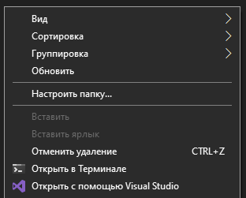
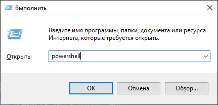

# Как отрыть командную строку?

Для открытия командной строки в нужной директории, откройте директорию в проводнике, нажмите ПКМ + Shift в любом свободном месте (не по файлам). В открывшемся контекстном меню выберите "Отрыть в терминале" либо "Открыть окно PowerShell здесь".

Альтернативный способ: нажмите клавиши Win + R и введите `powershell`, после этого нажмите Enter или кнопку "ОК".

В открытом окне напишите `cd "С:\Users\...\путь\до\директориии"`, указав директорию, в которой будете работать с кодом.

В MacOS найдите в Spotlight приложение "Терминал". После открытия введите команду `cd "С:\Users\...\путь\до\директориии"`, указав директорию, в которой будете работать с кодом.